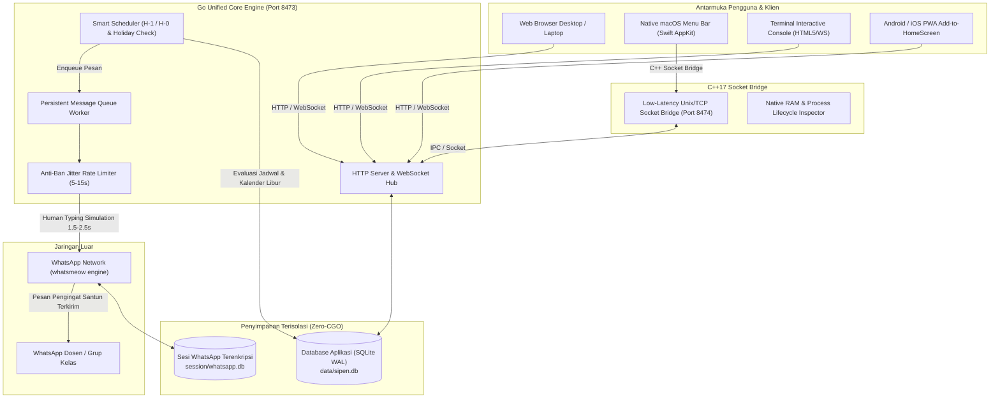

<p align="center">
  
</p>

<p align="center">
  <a href="https://github.com/fk0u/SiPenDosa/releases"></a>
  <a href="https://golang.org"></a>
  <a href="https://isocpp.org"></a>
  <a href="https://developer.apple.com/swift/"></a>
  <a href="https://www.android.com"></a>
  <a href="https://sqlite.org"></a>
  <a href="LICENSE"></a>
</p>

<p align="center">
  <strong>Sistem Pengingat Dosen Saatnya (SiPenDosa)</strong><br>
  <em>"Asisten cerdas yang rela 'berdosa' demi mengingatkan dosen, agar mahasiswa tidak perlu merasa sungkan."</em>
</p>

---

## 🧭 Daftar Isi
- [Makna & Filosofi Nama](#-makna--filosofi-nama)
- [Arsitektur Sistem](#-arsitektur-sistem)
- [📐 Dokumentasi Desain Sistem, Flow State & DFD Lengkap](docs/SYSTEM_DESIGN_AND_FLOWS.md)
- [Matriks Paket Rilis Resmi](#-matriks-paket-rilis-resmi-v111)
- [Fitur Utama](#-fitur-utama)
- [Panduan Instalasi Multi-Platform](#-panduan-instalasi-multi-platform)
  - [Apple macOS (DMG & PKG)](#-1-apple-macos-apple-silicon--intel)
  - [Microsoft Windows (Setup.exe)](#-2-microsoft-windows-10--11)
  - [Linux (Debian, Ubuntu, RedHat, Arch)](#-3-linux-ubuntu-debian-redhat-arch)
  - [Mobile (Android Standalone APK & Termux)](#-4-mobile-android-apk--ios-pwa)
- [Konfigurasi Environment (.env)](#-konfigurasi-environment-env)
- [Reverse Proxy & SSL Domain](#-reverse-proxy--ssl-domain)
- [Alur Penggunaan Pertama Kali](#-alur-penggunaan-pertama-kali)
- [Keamanan & Cadangan Data](#-keamanan--cadangan-data)
- [Lisensi](#-lisensi)

---

## 📖 Makna & Filosofi Nama

### 1. Kepanjangan Resmi
* **SiPenDosa** = **Sistem Pengingat Dosen Saatnya**  
* *Atau versi yang lebih “bernyawa”:*  
  **Si Pen Dosa** — Asisten yang rela “berdosa” demi mengingatkan dosen.

### 2. Penjelasan Makna

#### 🏛️ Versi Formal (Dokumentasi / SRS / Proposal Kampus)
> **SiPenDosa** adalah sistem pengingat jadwal perkuliahan otomatis dan terjadwal yang ditujukan kepada dosen pengampu mata kuliah. Nama ini diambil dari akronim resmi: **"Sistem Pengingat Dosen Saatnya"**.

#### ☕ Versi Mahasiswa (Jiwa & Realita Perkuliahan)
> Mengingatkan dosen berulang kali mengenai jadwal kuliah, ruang pengganti, atau kepastian kelas sering kali memicu dilema:  
> *Mahasiswa takut dianggap lancang, takut mengganggu jam istirahat dosen, atau dinilai tidak sopan.*  
> 
> Namun di sisi lain, kepastian jadwal adalah hak mahasiswa agar kegiatan belajar tetap teratur.  
> 
> **Maka SiPenDosa mengambil peran itu:**  
> Sebuah sistem otomasi beretika tinggi yang bertutur kata sopan, terstruktur, dan terkirim pada jendela waktu yang pantas — sehingga mahasiswa tidak perlu lagi merasa sungkan!

---

## 🏗️ Arsitektur Sistem

SiPenDosa dibangun dengan arsitektur **Polyglot Hybrid** yang memadukan keandalan Go, kecepatan C++17, dan keanggunan UI Apple Swift:



---

## 📦 Matriks Paket Rilis Resmi (`v1.1.2`)
- [Matriks Paket Rilis Resmi](#-matriks-paket-rilis-resmi-v112)

Semua paket rilis telah dikompilasi secara mandiri (*self-contained*), ditandatangani, dan siap langsung dipasang tanpa memerlukan dependensi eksternal:

| Platform | Format Paket | Deskripsi & Kegunaan | Lokasi / Download |
| :--- | :--- | :--- | :--- |
| **Android** | `SiPenDosa-Android.apk` | **Standalone APK** Universal (API 21+) Background Service 24/7 & Native Mobile UI | [Download APK](https://github.com/fk0u/SiPenDosa/releases/download/v1.1.2/SiPenDosa-Android.apk) |
| **Android (Store)** | `SiPenDosa-Android.aab` | **Google App Bundle** Universal Multi-Arch terkompresi | [Download AAB](https://github.com/fk0u/SiPenDosa/releases/download/v1.1.2/SiPenDosa-Android.aab) |
| **macOS** | `SiPenDosa-1.1.2.dmg` | **Apple Disk Image** Retina Custom Layout Drag-and-Drop ke `/Applications` | [Download DMG](https://github.com/fk0u/SiPenDosa/releases/download/v1.1.2/SiPenDosa-1.1.2.dmg) |
| **macOS** | `SiPenDosa-1.1.2-Installer.pkg` | **Apple Installer Package** Wizard resmi dengan LaunchAgent otomatis | [Download PKG](https://github.com/fk0u/SiPenDosa/releases/download/v1.1.2/SiPenDosa-1.1.2-Installer.pkg) |
| **Windows** | `SiPenDosa-Setup.exe` | **Windows Standalone Setup** (Desktop & Start Menu Shortcut, Uninstaller) | [Download EXE](https://github.com/fk0u/SiPenDosa/releases/download/v1.1.2/SiPenDosa-Setup.exe) |
| **Ubuntu / Debian** | `sipendosa_1.1.2_amd64.deb` | Paket DEB resmi dengan konfigurasi daemon **Systemd** otomatis (x86_64) | [Download DEB (amd64)](https://github.com/fk0u/SiPenDosa/releases/download/v1.1.2/sipendosa_1.1.2_amd64.deb) |
| **Debian ARM64** | `sipendosa_1.1.2_arm64.deb` | Paket DEB untuk arsitektur ARM64 (Raspberry Pi, Ampere, AWS Graviton) | [Download DEB (arm64)](https://github.com/fk0u/SiPenDosa/releases/download/v1.1.2/sipendosa_1.1.2_arm64.deb) |
| **Linux Universal** | `sipendosa_linux_amd64.tar.gz` | Tarball distribusi standalone untuk RedHat, CentOS, Fedora, Arch, SUSE | [Download Tarball](https://github.com/fk0u/SiPenDosa/releases/download/v1.1.2/sipendosa_linux_amd64.tar.gz) |
| **macOS Universal** | `sipendosa_macos_universal.tar.gz` | Tarball distribusi CLI & daemon LaunchAgent universal (ARM64 + x86_64) | [Download Tarball](https://github.com/fk0u/SiPenDosa/releases/download/v1.1.2/sipendosa_macos_universal.tar.gz) |

---

## 🌟 Fitur Utama

1. **WhatsApp Engine Modern (`go.mau.fi/whatsmeow`)**:
   - Pemindaian QR Code interaktif di terminal atau Web Dashboard via WebSocket secara *real-time*.
   - Sesi terenkripsi dan terisolasi di database SQLite terpisah (`session/whatsapp.db`).
   - Fitur **Anti-Ban Shield**:
     - Normalisasi otomatis nomor telepon Indonesia (`08...` &rarr; `628...@s.whatsapp.net`).
     - Simulasi kehadiran manusia (*human presence simulation*): Menandai status *Online*, simulasi *Composing / Sedang mengetik...* dengan jeda acak (*jitter* 1.5–2.5 detik) sebelum pengiriman pesan fisik.
2. **Smart Scheduler (H-1 & Timezone Aware)**:
   - Pengingat perkuliahan mode **H-1** (satu hari sebelumnya) atau **H-0** (hari H).
   - Zona waktu bawaan **Asia/Makassar (WITA, UTC+8)** (dapat disesuaikan ke WIB atau WIT).
   - Pengecekan daftar **Hari Libur**: Melewati jadwal secara cerdas tanpa mengganggu dosen pada hari libur nasional atau cuti kampus.
   - Pengecekan rentang jam operasional (default `08:00` s.d. `16:00`).
   - **Hitung Mundur Real-time** menuju jadwal berikutnya di dashboard.
3. **Template Engine Dinamis**:
   - Variabel bawaan: `{{.NamaDosen}}`, `{{.NamaMahasiswa}}`, `{{.NIM}}`, `{{.Matkul}}`, `{{.Hari}}`, `{{.Tanggal}}`, `{{.JamMulai}}`, `{{.JamSelesai}}`, `{{.Lokasi}}`, `{{.LinkGroup}}`, `{{.HariDalamBahasa}}`.
   - Editor template interaktif dengan **Live Preview** seketika saat mengetik.
   - **Audit Trail**: Riwayat versi template tersimpan otomatis.
4. **Message Queue & Auto-Retry Worker**:
   - Antrian persisten dengan pemrosesan terisolasi di latar belakang.
   - Jeda acak 5–15 detik antar pesan untuk menghindari deteksi spam WhatsApp.
   - Mekanisme *auto-retry* 3x dengan *exponential backoff* bila koneksi terputus.
5. **Terminal Mode Interaktif (`/terminal`)**:
   - Tampilan konsol shell bertema Termux dengan streaming log WebSocket real-time.
   - Prompt interaktif (`status`, `ip`, `reconnect`, `clear`, `help`).
6. **Desain Visual Eksklusif (Scarlet Rose & Burnished Gold)**:
   - Antarmuka responsif tanpa warna biru/ungu generik — dirancang elegan dengan persona Crimson Scarlet (`#e11d48`) dan Burnished Gold (`#f59e0b`).
   - 100% responsif di layar ponsel maupun desktop ultra-wide.
7. **Pembaruan Otomatis & In-App Changelog Center (`/changelog`)**:
   - Pengecekan rilis terbaru otomatis langsung dari GitHub Releases saat aplikasi dibuka.
   - Modal pembaruan instan dengan tombol unduh langsung 1-klik tanpa ribet.
   - Catatan rilis komprehensif langsung di dalam aplikasi (bento-grid, filter kategori, badge versi resmi).
8. **Pengalaman Mobile Native & Graphify Knowledge Graph**:
   - Antarmuka Android 100% native: Splash loader, status bar adaptif, floating LAN action pill, dialog native, dan 5-tab bottom navigation bar ergonomis.
   - Terintegrasi dengan **Graphify Knowledge Graph** (`.agents/skills/graphify` & `graphify CLI`) untuk analisis struktur kode berbasis graph intelligence.

---

## 💻 Panduan Instalasi Multi-Platform

### 🍎 1. Apple macOS (Apple Silicon & Intel)

#### Opsi A: Apple Disk Image (`SiPenDosa-1.1.2.dmg`) — Sangat Direkomendasikan!
1. Unduh [SiPenDosa-1.1.2.dmg](https://github.com/fk0u/SiPenDosa/releases/download/v1.1.2/SiPenDosa-1.1.2.dmg).
2. Buka berkas DMG. Jendela Finder akan menampilkan antarmuka kustom SiPenDosa.
3. **Seret (drag)** ikon `SiPenDosa.app` ke ikon `Applications`.
4. Buka aplikasi dari folder `Applications` atau Launchpad.
5. Ikon **⚡ SiPenDosa** akan muncul di Menu Bar kanan atas dengan kontrol instan (Buka Web Dashboard, Scan QR, Status Server, Log).

#### Opsi B: Apple Installer Package (`SiPenDosa-1.1.2-Installer.pkg`)
1. Unduh dan buka [SiPenDosa-1.1.2-Installer.pkg](https://github.com/fk0u/SiPenDosa/releases/download/v1.1.2/SiPenDosa-1.1.2-Installer.pkg).
2. Ikuti panduan wizard instalasi hingga selesai.
3. Paket ini otomatis mengonfigurasi **LaunchAgent daemon** sehingga server selalu aktif di latar belakang saat Mac dinyalakan.

---

### 🪟 2. Microsoft Windows (10 & 11)

#### Opsi A: Standalone Setup Wizard (`SiPenDosa-Setup.exe`)
1. Unduh [SiPenDosa-Setup.exe](https://github.com/fk0u/SiPenDosa/releases/download/v1.1.2/SiPenDosa-Setup.exe).
2. Klik dua kali untuk menjalankan installer (tidak memerlukan izin Administrator).
3. Installer akan:
   - Memasang berkas ke `%LOCALAPPDATA%\Programs\SiPenDosa`.
   - Meng-generate file `.env` produksi dengan token rahasia 32 karakter secara otomatis.
   - Membuat **Desktop Shortcut** dan folder **Start Menu**.
   - Mendaftarkan entri di **Windows Settings > Installed Apps** (Add/Remove Programs).
4. Selesai! Klik shortcut Desktop untuk langsung membuka aplikasi.

---

### 🐧 3. Linux (Ubuntu, Debian, RedHat, Arch)

#### Opsi A: Paket Debian / Ubuntu (`.deb`)
```bash
# Untuk arsitektur x86_64 / amd64:
sudo dpkg -i sipendosa_1.1.2_amd64.deb

# Untuk arsitektur ARM64:
sudo dpkg -i sipendosa_1.1.2_arm64.deb

# Cek status daemon:
sudo systemctl status sipen
```

#### Opsi B: Universal Standalone Tarball (`install-linux.sh`)
```bash
tar -xzf sipendosa_linux_amd64.tar.gz
cd sipendosa_linux_amd64
sudo ./install-linux.sh
```
Skrip instalasi ini otomatis mendeteksi distro, membuat user `sipen`, mendaftarkan daemon `sipen.service`, dan membuka port firewall.

---

### 📱 4. Mobile (Android APK & iOS PWA)

#### 🤖 Opsi A: Standalone Android APK (`SiPenDosa-Android.apk`)
1. Unduh [SiPenDosa-Android.apk](https://github.com/fk0u/SiPenDosa/releases/download/v1.1.2/SiPenDosa-Android.apk) ke HP Android Anda lalu pasang (izinkan instalasi APK dari browser jika diminta).
2. Buka aplikasi. Secara otomatis:
   - **Foreground Service & Wakelock** akan aktif di latar belakang agar server tidak dimatikan oleh sistem Android.
   - Antarmuka **100% Native Mobile App** dengan native splash loader, status bar adaptif, floating LAN action pill, dialog native, dan bottom navigation bar interaktif.
3. Buka browser di laptop yang satu jaringan Wi-Fi, akses: `http://<IP_HANDPHONE>:8473` untuk mengelola jadwal dari laptop!

#### 💻 Opsi B: Android via Termux murni
1. Buka Termux di smartphone Android Anda.
2. Jalankan skrip installer (bisa langsung melalui `curl` atau dari folder repositori):
   ```bash
   # Cara 1: Instalasi instan via curl
   curl -fsSL https://raw.githubusercontent.com/fk0u/SiPenDosa/master/install-android-termux.sh | bash
   
   # Cara 2: Dari repositori lokal
   ./install-android-termux.sh
   ```
3. Kelola server menggunakan perintah terminal praktis:
   - `sipen-start` : Menyalakan server interaktif dengan Auto-Wakelock (layar mati tetap aktif).
   - `sipen-bg`    : Menjalankan server di latar belakang (*silent daemon*).
   - `sipen-stop`  : Menghentikan server dan melepaskan Wakelock baterai.
   - `sipen`       : Eksekusi langsung engine SiPenDosa.

#### 🍏 Opsi C: iOS (iPhone / iPad) PWA
1. Buka Safari di iPhone, akses dashboard SiPenDosa (misal `http://192.168.1.10:8473`).
2. Tekan tombol **Share** di Safari &rarr; pilih **"Add to Home Screen"**.
3. Aplikasi SiPenDosa siap digunakan fullscreen dari layar utama iPhone Anda.

---

## ⚙️ Konfigurasi Environment (`.env`)

```env
PORT=8473
HOST=0.0.0.0
APP_ENV=production
SESSION_SECRET=ganti-dengan-string-acak-minimal-32-karakter

DB_PATH=data/sipen.db
WA_SESSION_PATH=session/whatsapp.db

DEFAULT_TIMEZONE=Asia/Makassar
SEND_WINDOW_START=08:00
SEND_WINDOW_END=16:00

RATE_LIMIT_MIN_SEC=5
RATE_LIMIT_MAX_SEC=15
MAX_RETRIES=3

GLOBAL_DRY_RUN=false
```

---

## 🌐 Reverse Proxy & SSL Domain

### Menggunakan Nginx:
```nginx
server {
    server_name sipendosa.kampus.ac.id;

    location / {
        proxy_pass http://127.0.0.1:8473;
        proxy_http_version 1.1;
        
        # WebSocket Support
        proxy_set_header Upgrade $http_upgrade;
        proxy_set_header Connection "upgrade";
        
        proxy_set_header Host $host;
        proxy_set_header X-Real-IP $remote_addr;
        proxy_set_header X-Forwarded-For $proxy_add_x_forwarded_for;
        proxy_set_header X-Forwarded-Proto $scheme;
    }
}
```

### Menggunakan Caddy:
```caddy
sipendosa.kampus.ac.id {
    reverse_proxy localhost:8473
}
```

---

## 🚀 Alur Penggunaan Pertama Kali

1. **Buka Dashboard**: Akses `http://localhost:8473` atau alamat IP server Anda.
2. **Registrasi SuperAdmin**: Buat akun administrator pada kunjungan pertama. Pendaftaran otomatis ditutup setelah akun pertama terbuat.
3. **Pindai QR WhatsApp**: Klik **"Scan QR Code"** di bar atas atau buka aplikasi WhatsApp di ponsel &rarr; **Perangkat Tertaut** &rarr; Pindai QR.
4. **Isi Data Dosen & Jadwal**: Masukkan kontak dosen dan waktu perkuliahan.
5. **Uji Jadwal (Dry-Run)**: Gunakan fitur simulasi untuk memastikan format pesan sudah sesuai sebelum dikirimkan secara langsung.

---

## 🔒 Keamanan & Cadangan Data

- **Backup Basis Data**: Unduh cadangan database `.db` secara instan dari menu **Pengaturan > Unduh Cadangan Database**.
- **Sesi WhatsApp**: Berkas sesi disimpan di `session/whatsapp.db`. Selama berkas ini dipertahankan, koneksi WhatsApp tidak perlu dipindai ulang saat aplikasi dimuat ulang.
- **Isolasi Zero-CGO**: Seluruh modul SQLite berjalan via pure Go (`modernc.org/sqlite`), menjamin tidak adanya memory leak dari pustaka C eksternal di runtime server.

---

## 🗺️ Roadmap & Rencana Masa Depan

Lihat rencana pengembangan fitur selanjutnya, termasuk *Group & Contact Picker Dropdown*, *Built-in Public Tunneling*, dan *Public Schedule Portal* pada dokumen **[ROADMAP.md](ROADMAP.md)** atau pantau di **[GitHub Issues](https://github.com/fk0u/SiPenDosa/issues)**.

---

## 📄 Lisensi

Proyek ini dirilis di bawah lisensi **[MIT License](LICENSE)**. Bebas digunakan, dikembangkan, dan dimanfaatkan untuk mempermudah kegiatan perkuliahan di seluruh kampus Indonesia.
