# 📐 Dokumentasi Desain Sistem, Diagram Alur & DFD Lengkap SiPenDosa (v1.1.0)
*Sistem Pengingat Dosen Saatnya — Universal Multi-Platform & Multi-Device WhatsApp Automation*

---

## 📑 Daftar Isi
1. [Ikhtisar Arsitektur Sistem (High-Level Topology)](#1-ikhtisar-arsitektur-sistem-high-level-topology)
2. [Data Flow Diagram (DFD) Seluruh Level](#2-data-flow-diagram-dfd-seluruh-level)
   - [2.1 DFD Level 0 (Context Diagram)](#21-dfd-level-0-context-diagram)
   - [2.2 DFD Level 1 (Macro Subsystems Decomposition)](#22-dfd-level-1-macro-subsystems-decomposition)
   - [2.3 DFD Level 2 — Proses 2.0: WhatsApp Connection Engine (QR & Pairing)](#23-dfd-level-2--proses-20-whatsapp-connection-engine-qr--pairing)
   - [2.4 DFD Level 2 — Proses 4.0 & 6.0: Smart Scheduler & Anti-Ban Dispatch Queue](#24-dfd-level-2--proses-40--60-smart-scheduler--anti-ban-dispatch-queue)
   - [2.5 DFD Level 2 — Proses 1.0: Autentikasi, RBAC & OWASP Security Pipeline](#25-dfd-level-2--proses-10-autentikasi-rbac--owasp-security-pipeline)
3. [Diagram Mesin Status (Flow State Diagrams)](#3-diagram-mesin-status-flow-state-diagrams)
   - [3.1 WhatsApp Connection State Machine](#31-whatsapp-connection-state-machine)
   - [3.2 Message Queue Lifecycle State Machine](#32-message-queue-lifecycle-state-machine)
   - [3.3 Schedule Job Lifecycle State Machine](#33-schedule-job-lifecycle-state-machine)
   - [3.4 Android Daemon & Wakelock Service Lifecycle](#34-android-daemon--wakelock-service-lifecycle)
4. [User Flow & Alur Pengguna Interaktif](#4-user-flow--alur-pengguna-interaktif)
   - [4.1 Alur Onboarding & Registrasi SuperAdmin Pertama](#41-alur-onboarding--registrasi-superadmin-pertama)
   - [4.2 Alur Taut Perangkat WhatsApp (QR vs Pairing Code Nomor HP)](#42-alur-taut-perangkat-whatsapp-qr-vs-pairing-code-nomor-hp)
   - [4.3 Alur Pengelolaan Jadwal Kuliah & Template Dinamis](#43-alur-pengelolaan-jadwal-kuliah--template-dinamis)
   - [4.4 Alur Eksekusi Headless via Android Termux CLI](#44-alur-eksekusi-headless-via-android-termux-cli)
5. [Diagram Urutan Interaksi (Sequence Diagrams)](#5-diagram-urutan-interaksi-sequence-diagrams)
   - [5.1 Sequence: Login via Phone Pairing Code](#51-sequence-login-via-phone-pairing-code)
   - [5.2 Sequence: Smart Scheduler -> Evaluasi Hari Libur -> Anti-Ban Dispatch](#52-sequence-smart-scheduler---evaluasi-hari-libur---anti-ban-dispatch)
   - [5.3 Sequence: OWASP Security Interceptor Pipeline](#53-sequence-owasp-security-interceptor-pipeline)
6. [Diagram Relasi Entitas (Entity-Relationship Diagram / ERD)](#6-diagram-relasi-entitas-entity-relationship-diagram--erd)

---

## 1. Ikhtisar Arsitektur Sistem (High-Level Topology)

SiPenDosa mengusung arsitektur **Zero-CGO Pure Go Monolith** dengan antarmuka native adaptif untuk macOS (Swift + C++17 Socket Bridge), Android (Java Foreground Service + Wakelock), Linux (Systemd Service), dan Termux (Headless Shell CLI).

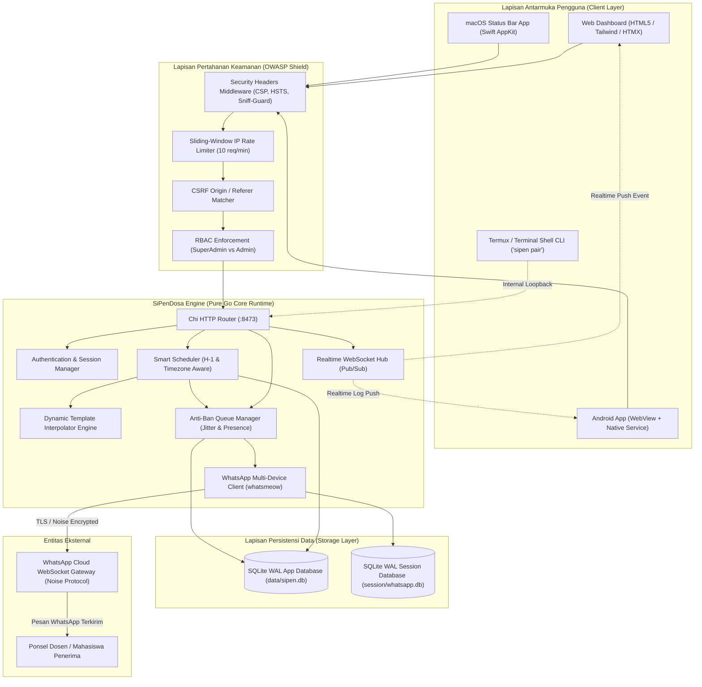

---

## 2. Data Flow Diagram (DFD) Seluruh Level

### 2.1 DFD Level 0 (Context Diagram)

Context diagram memetakan batas sistem (*system boundary*) antara SiPenDosa dengan 4 entitas eksternal: **Pengguna / Mahasiswa (PJ Matkul)**, **SuperAdmin Sistem**, **WhatsApp Gateway Server**, dan **Dosen Tujuan**.

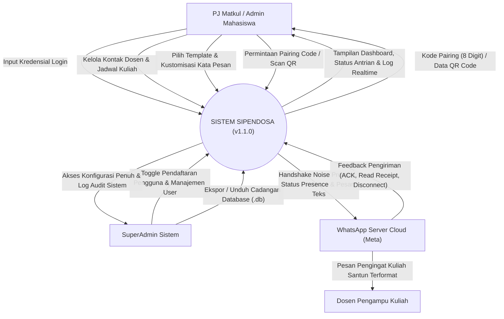

---

### 2.2 DFD Level 1 (Macro Subsystems Decomposition)

Mendekomposisi sistem menjadi 7 proses subsistem utama dan 2 data store SQLite independen.

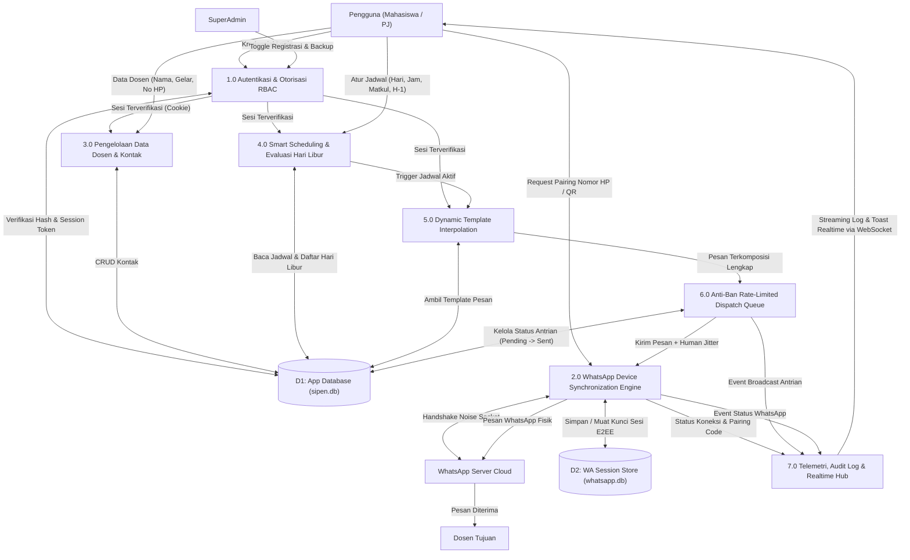

---

### 2.3 DFD Level 2 — Proses 2.0: WhatsApp Connection Engine (QR & Pairing)

Menampilkan detail proses penautan perangkat baru melalui pemindaian QR Code visual vs penautan kode telepon 8 karakter (Pairing Code) tanpa kamera.

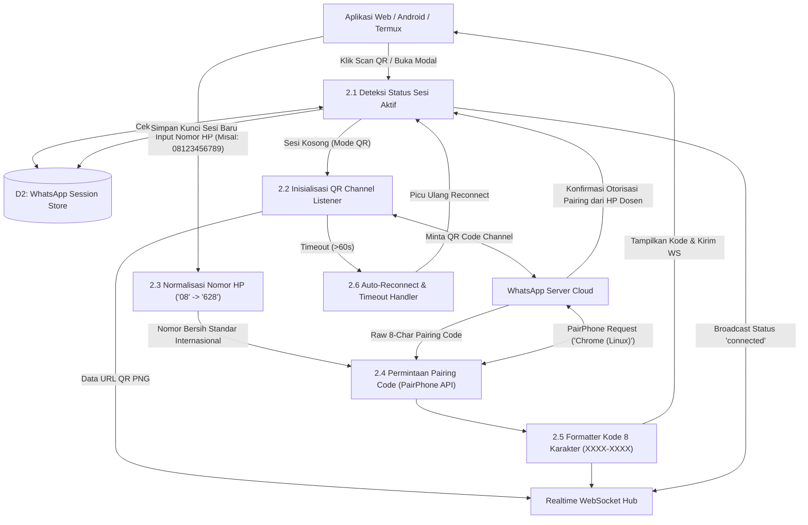

---

### 2.4 DFD Level 2 — Proses 4.0 & 6.0: Smart Scheduler & Anti-Ban Dispatch Queue

Alur evaluasi jadwal cerdas (mengecek hari libur dan rentang waktu kerja) hingga pengiriman pesan dengan jeda kehadiran acak (*human jitter*).

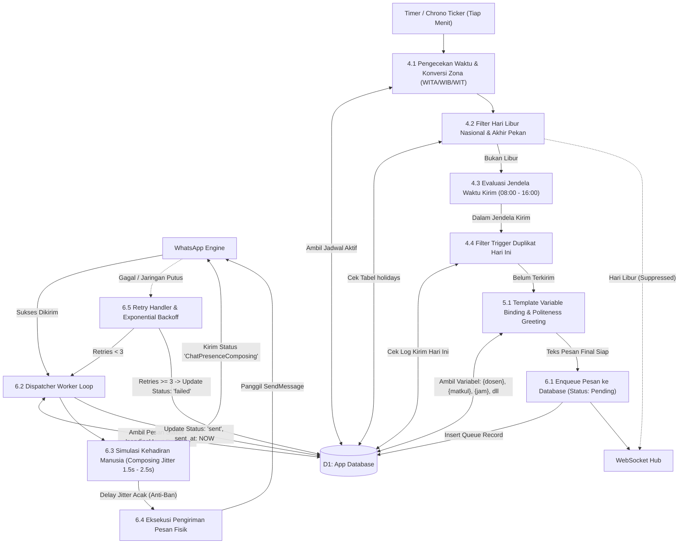

---

### 2.5 DFD Level 2 — Proses 1.0: Autentikasi, RBAC & OWASP Security Pipeline

Alur verifikasi keamanan berlapis untuk setiap request HTTP yang masuk ke server.

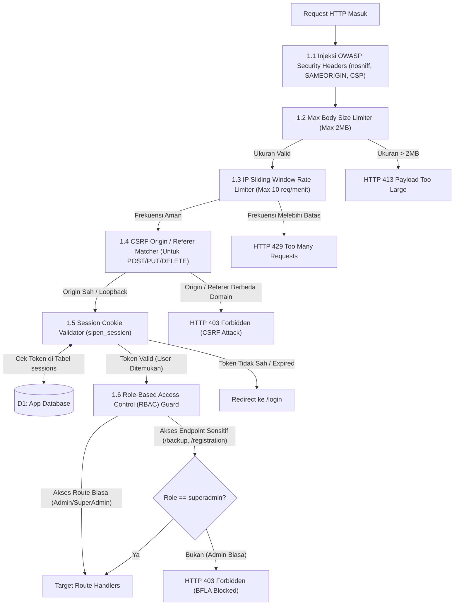

---

## 3. Diagram Mesin Status (Flow State Diagrams)

### 3.1 WhatsApp Connection State Machine

Status koneksi WhatsApp client dikelola oleh event-driven state machine:

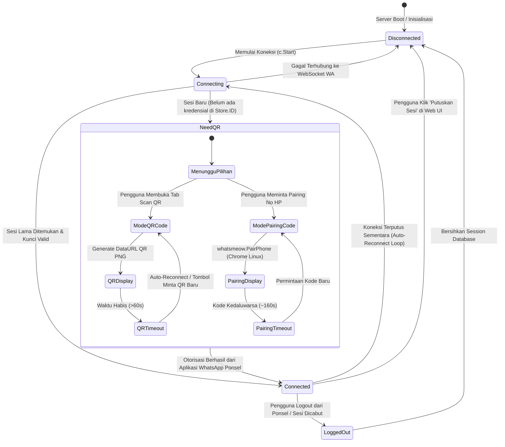

---

### 3.2 Message Queue Lifecycle State Machine

Setiap pesan pengingat dosen yang dijadwalkan melewati siklus hidup berikut:

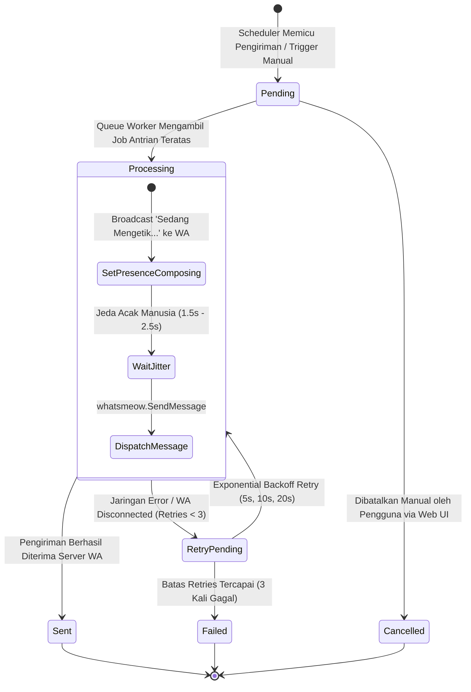

---

### 3.3 Schedule Job Lifecycle State Machine

Status jadwal mata kuliah yang dievaluasi berkala oleh scheduler:

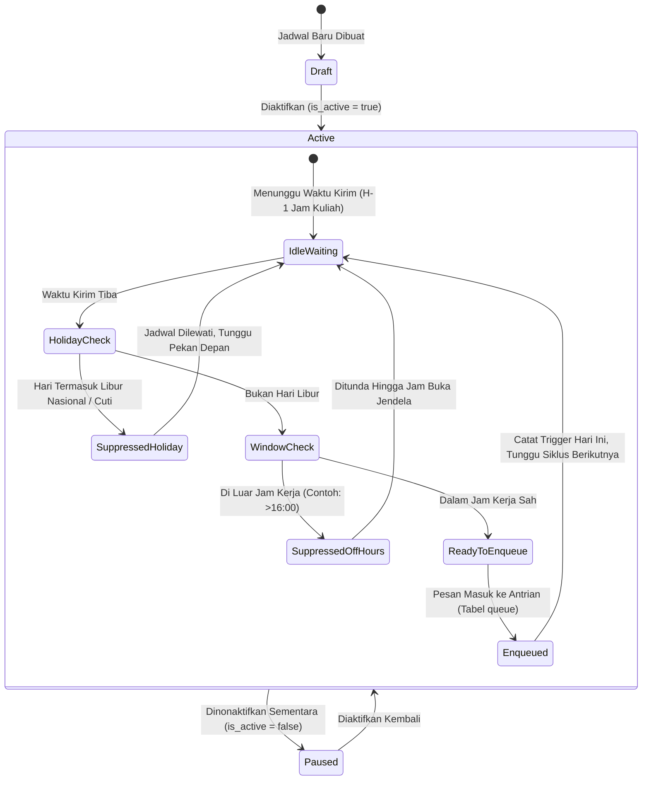

---

### 3.4 Android Daemon & Wakelock Service Lifecycle

Siklus hidup aplikasi Android APK saat beroperasi sebagai server mandiri di smartphone:

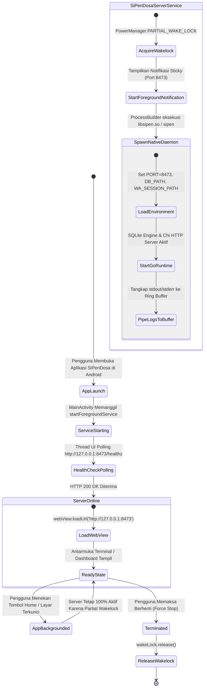

---

## 4. User Flow & Alur Pengguna Interaktif

### 4.1 Alur Onboarding & Registrasi SuperAdmin Pertama

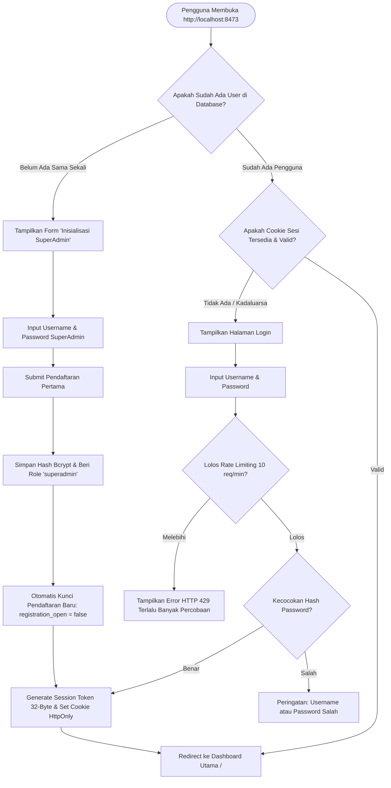

---

### 4.2 Alur Taut Perangkat WhatsApp (QR vs Pairing Code Nomor HP)

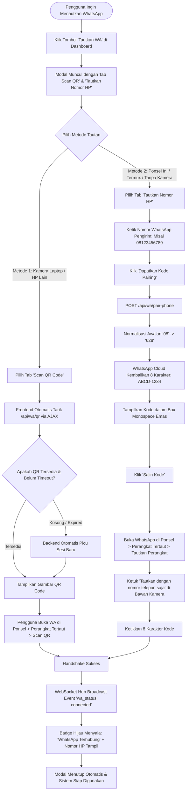

---

### 4.3 Alur Pengelolaan Jadwal Kuliah & Template Dinamis

```mermaid
flowchart TD
    Start([Pengguna Mengakses Menu Jadwal /schedules]) --> ViewList[Tinjau Daftar Jadwal Aktif & Filter Hari]
    
    ViewList --> ActionChoice{Aksi Pengguna}
    
    ActionChoice -->|Tambah Jadwal Baru| OpenForm[Klik 'Tambah Jadwal Kuliah']
    OpenForm --> FillData[Isi: Nama Matkul, Kode Kelas, Ruang, Hari, Jam Mulai, Dosen Pengampu]
    FillData --> SelectTmpl[Pilih Template Pesan Pengingat]
    SelectTmpl --> SetHMin[Tentukan Waktu Kirim: H-1 Jam Kerja atau Hari-H]
    SetHMin --> SaveSchedule[Simpan ke SQLite Database]
    SaveSchedule --> ToastSuccess[Notifikasi Toast: 'Jadwal Kuliah Berhasil Disimpan']

    ActionChoice -->|Uji Coba Pesan Instan| TestTrigger[Klik Tombol 'Trigger Sekarang']
    TestTrigger --> QueueImmediate[Enqueue Pesan ke Antrian dengan Prioritas Tinggi]
    QueueImmediate --> DispatchNow[Eksekusi via WhatsApp Engine Seketika]

    ActionChoice -->|Kustomisasi Template| OpenTmplMenu[Buka Menu /templates]
    OpenTmplMenu --> EditTemplate[Pilih Template & Ubah Kalimat Salam / Bahasa]
    EditTemplate --> InsertVariables[Sisipkan Tag: {dosen}, {matkul}, {jam}, {ruang}, {hari}]
    InsertVariables --> LivePreview[Gunakan Live Preview Interaktif untuk Uji Tampilan Pesan]
    LivePreview --> SaveTmpl[Simpan Template]
```

---

### 4.4 Alur Eksekusi Headless via Android Termux CLI

```mermaid
flowchart TD
    Start([Buka Aplikasi Termux di Smartphone Android]) --> InstallCheck{SiPenDosa Sudah Terpasang?}
    
    InstallCheck -->|Belum| RunInstaller[Jalankan: curl -fsSL .../install-android-termux.sh | bash]
    RunInstaller --> SetupFiles[Installer Memasang Binary, Config .env & Shortcut PATH]
    SetupFiles --> ReadyCLI[Shortcut Siap: sipen, sipen-start, sipen-pair, sipen-stop]
    
    InstallCheck -->|Sudah| StartChoice{Mode Menjalankan Server}
    
    StartChoice -->|Mode Latar Belakang (24/7)| RunBg[Ketik: sipen-bg]
    RunBg --> AcquireLock[Aktifkan Android Wakelock via termux-wake-lock]
    AcquireLock --> RunNohup[nohup sipen > sipen.log 2>&1 &]
    RunNohup --> ServerRunning[Server Aktif di Latar Belakang (Port 8473)]

    StartChoice -->|Mode Interaktif| RunFg[Ketik: sipen-start]
    RunFg --> ServerRunning

    ServerRunning --> NeedPairing{Apakah Perlu Login WhatsApp?}
    NeedPairing -->|Ya (Tanpa Buka Browser)| RunPairCmd[Ketik: sipen pair 08123456789]
    RunPairCmd --> LoopbackReq[Kirim Permintaan ke http://127.0.0.1:8473/api/internal/pair-phone]
    LoopbackReq --> OutputTerm[Konsol Termux Menampilkan Banner Kuning & Kode: ABCD-1234]
    OutputTerm --> EnterInWA[Buka WhatsApp Ponsel > Perangkat Tertaut > Tautkan No Telepon]
    EnterInWA --> ConnectedTerm[WhatsApp Terhubung Secara Headless]

    NeedPairing -->|Tidak (Sesi Sudah Tersimpan)| CheckStatus[Ketik: curl http://localhost:8473/healthz]
```

---

## 5. Diagram Urutan Interaksi (Sequence Diagrams)

### 5.1 Sequence: Login via Phone Pairing Code

Diagram urutan langkah sinkronisasi kode pairing antara Browser/Klien, Server SiPenDosa, Engine WhatsMeow, WebSocket Hub, dan Cloud Server WhatsApp.

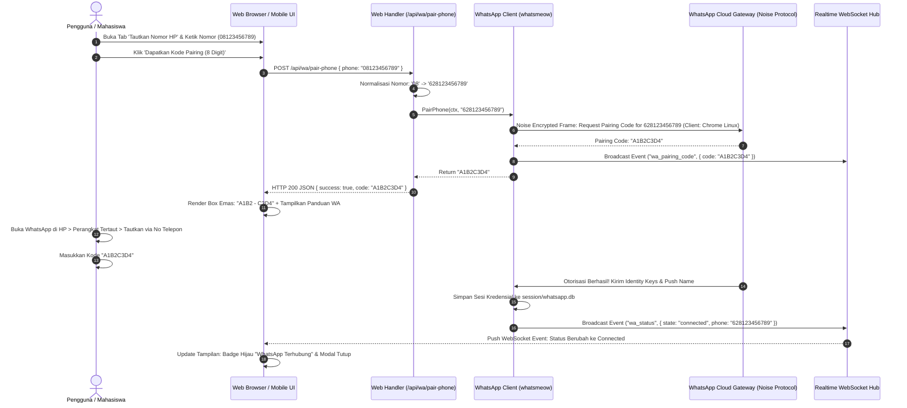

---

### 5.2 Sequence: Smart Scheduler -> Evaluasi Hari Libur -> Anti-Ban Dispatch

Menunjukkan bagaimana scheduler mengevaluasi hari libur nasional sebelum merilis pesan ke antrian dan menyimulasikan jeda pengetikan manusia (*typing presence*).

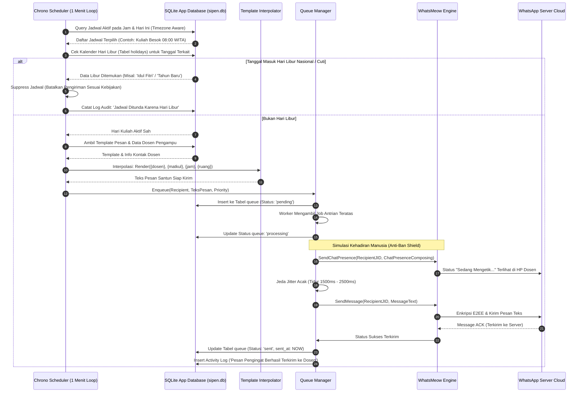

---

### 5.3 Sequence: OWASP Security Interceptor Pipeline

Menjelaskan lapisan pencegahan terhadap serangan BFLA, CSRF, Brute Force, dan DoS pada setiap request API.

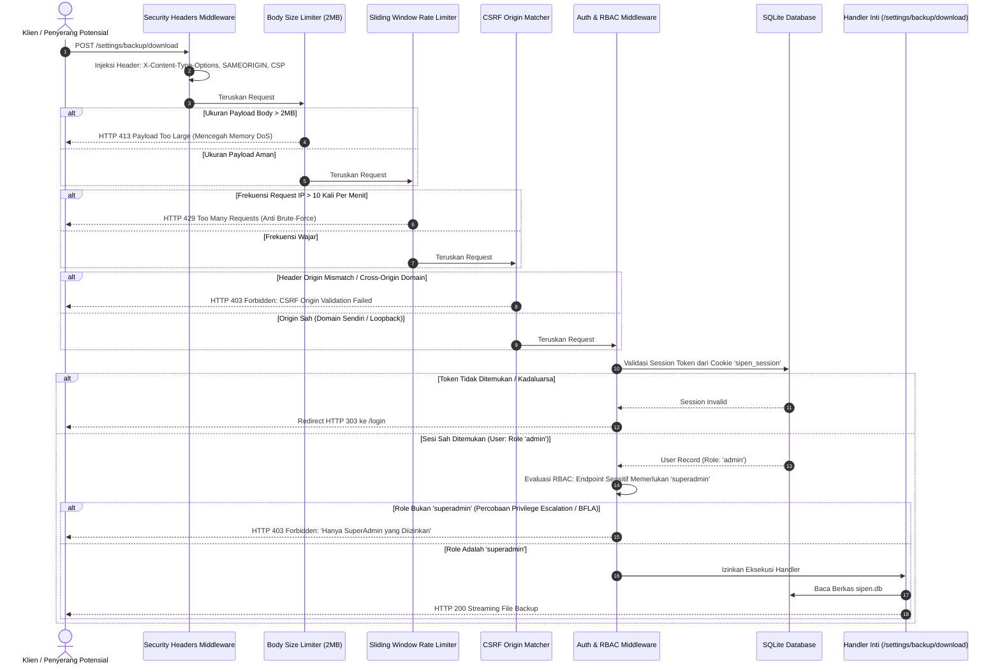

---

## 6. Diagram Relasi Entitas (Entity-Relationship Diagram / ERD)

Struktur tabel database SQLite murni (`sipen.db`) yang telah dinormalisasi dengan mode transaksi WAL (*Write-Ahead Logging*):

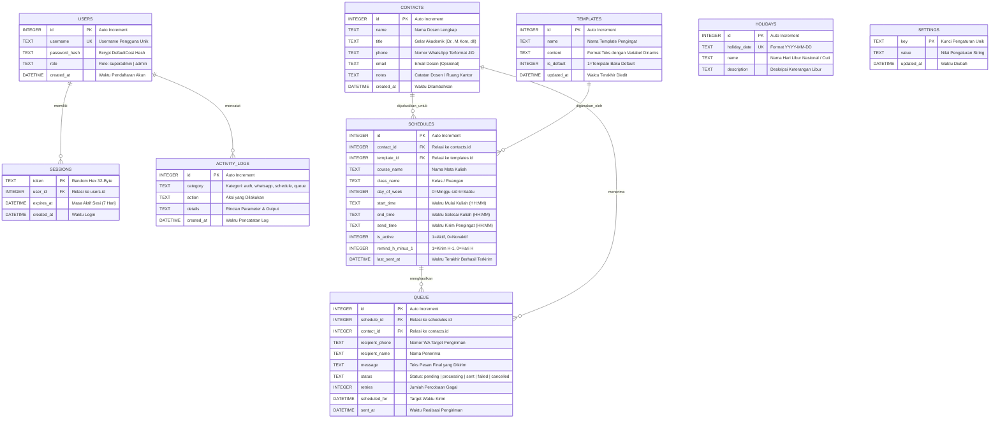

---

## 7. Rangkuman Spesifikasi Teknis & Kepatuhan Keamanan

| Komponen | Spesifikasi & Standar yang Diimplementasikan |
| :--- | :--- |
| **Bahasa & Compiler** | Go 1.27 (Zero-CGO Pure Go Monolith), C++17 Socket Bridge, Swift 6.3 AppKit |
| **Engine WhatsApp** | `go.mau.fi/whatsmeow` Multi-Device E2EE (Noise Protocol) |
| **Protokol Login WA** | Dual-Method: (1) Visual QR Code PNG + (2) 8-Digit Pairing Code (`whatsmeow.PairPhone`) |
| **Database Storage** | SQLite 3 dengan mode `WAL (Write-Ahead Logging)` & Foreign Keys Enforced |
| **Arsitektur Android** | Standalone Universal APK (API 21+) + AAB Google Play + Termux Headless CLI |
| **Keamanan OWASP** | BFLA Protection, CSRF Origin Verification, Sliding-Window Rate Limiter, Security Headers, Memory DoS Cap (2MB) |
| **Realtime Transport** | Gorilla WebSocket Hub dengan event multiplexing (`wa_status`, `wa_qr`, `wa_pairing_code`, `countdown`, `toast`, `queue_update`) |

---
*Dokumentasi ini resmi disusun untuk SiPenDosa Unified Edition versi 1.1.0.*
